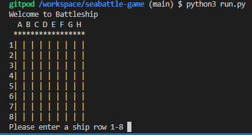
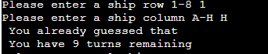

#Seabattles

###Seabattles is a Python termnal game, wich runs in the Code Institute mock terminal on Heroku.

Users can try to beat the computer by finding all five battleships with the 10 opportunities the game offers. Each battleship occupies one square on the board.

#How to play

Seabattles is based on the classic pen-and-paper game. You can read more about it on Wikipedia.

In this version, the player guess and choose a combination of a letter in a range from A to H in uppercases for the columns and a number from 1 to 8 for the rows to coordinate an attack on the hidden and randomly generated battleships on the playing board.

The guesses are marked with an X for a hit on a ship and - for a miss.
The ships only covers one mark each and there are five hidden

When and if the player hits all the five ships, then the player wins and the game is over, or if the player miss to hit all the five ships with the ten tries, then the game is also over.

#Features

###Existing Features

Random board generation

Ships are randomly placed on the screenboard.
The player can not see where the computers ships are.

Play against the computer
Accepts users input
Maintains scores
Shows message of where the user missed

Shows message of where the user hit

<<<<<<< HEAD

=======

>>>>>>> 17a613c (add README.md file changes)

Input validation and error-checking
you cannot enter coordinates outside the stipuleted values. 

You cannot enter the same guess twice

<<<<<<< HEAD

Data maintained 

=======
>>>>>>> dd973c9 (initial commit)
#Testing

I have manually tested this project by doing the following:

<<<<<<< HEAD
<<<<<<< HEAD
Passed the code through a PEP8 linter and confirmed there are no problems.
Given invalid inputs: strings when numbers are expected, out of bounds inputs and  same input twice.
Tested in my local terminal and the Code Institute Heroku terminal
=======
Passed the code throug a PEP8 linter and confirmed there are no bigger problems.
Given invalid inputs: strings when numbers are expected, out of bounds inputs, same input twice.
<<<<<<< HEAD
Tested in my local terminal and the Code Institute Heroku termin
>>>>>>> dd973c9 (initial commit)
=======
=======
Passed the code through a PEP8 linter and confirmed there are no problems.
Given invalid inputs: strings when numbers are expected, out of bounds inputs and  same input twice.
>>>>>>> 17a613c (add README.md file changes)
Tested in my local terminal and the Code Institute Heroku terminal
>>>>>>> 2daaf43 (git)

#Bugs

###Solved Bugs
When I wrote the project, I was getting indentation problems, and coding problems that I needed to fix along the way.

#Remaining Bugs

No bugs remains

#Validator Testing

Pep8
No bigger errors were returned from PEP8 after corrections.

#Deployment

This project was deployed using Code Institute´s mock terminal for Heroku.

##Steps for deployment:

Clone this repository
Create a new Heroku app
Set the buildbacks to Python and NodeJs in taht order
Link the Heroku app to the repository
Click on Deploy

#Credits 

Code Institute for the deployment terminal
Wikipedia for the details of the Seabattles game
copyassignments webpage for explication and information about what codes function and why:

("https://copyassignment.com/battleship-game-code-in-python/") and also ("https://www.youtube.com/watch?v=tF1WRCrd_HQ")

#Hope you enjoy the game!
